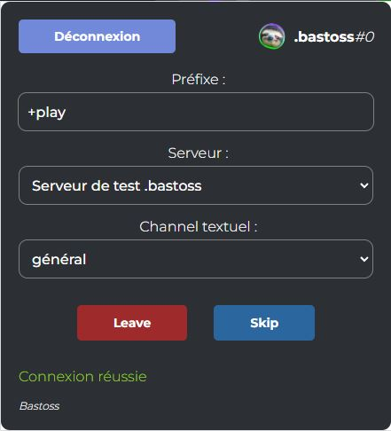
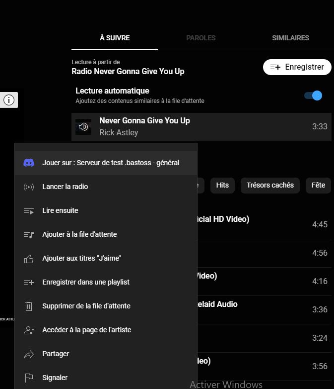

### **Extension de navigateur pour envoyer des liens Youtube & Youtube Music sur un channel textuel discord avec un simple clic droit.**

# Installer l’extension

### **_Google Chrome & Opera GX :_**

1. **[Chrome-MusicFast-1.0.1.zip](./MusicFast-Chrome-1.0.1.zip) + Dézip**
2. **Va à [chrome://extensions/](chrome://extensions/) et tu coches la case en haut à droite de la page "Mode développeur"**
3. **Clique sur "Charger l'extension non empaquetée" en haut à gauche et tu choisis le dossier téléchargé**

---

### **_Firefox :_**

1. **[Firefox-MusicFast-1.0.1.zip](./MusicFast-Firefox-1.0.1.zip) + Dézip**
2. **Clique DROIT -> Ouvrir avec... -> Firefox**

# Tips pour utiliser l’extension

-   **Tu peux épingler l'extension à la barre du navigateur, c'est mieux**
-   **Pour mettre de la musique depuis Youtube, soi, tu cliques droit sur une vidéo et en bas de la liste, tu peux envoyer sur discord, ou bien quand tu es sur une vidéo tu cliques sur “partager” en dessous de la vidéo et là, tu peux envoyer sur le discord**
-   **Pour mettre de la musique depuis YoutubeMusic, tu cliques droit et envoies sur le discord, il y a certaines listes que tu ne peux pas mettre genre les Mix personnalisés ou les “Radio” des artistes, et tes propres playlists doivent être en mode public.**
-   **Quand tu es connecté avec l'extension ouverte, tu peux choisir un serveur et un channel dans lequel les liens iront directement, tu peux aussi choisir un préfixe qui apparaîtra devant tout les liens envoyés ( "/play" par défaut )**
-   **Pour utiliser les bottons "Leave" et "Skip", il faut appuyer enfoncé 1s dessus pour éviter le spam**
-   **Si il y a un bug quelconque, rafraîchir la page peux aider**
